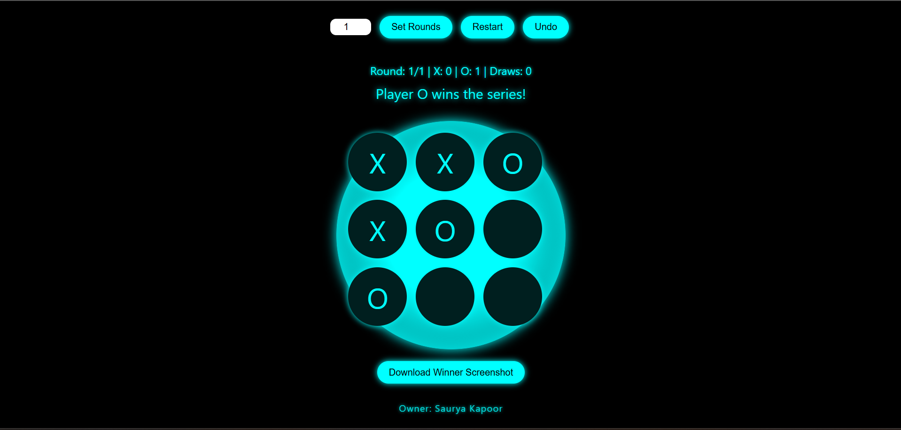

# ✨ Neon Tic Tac Toe 🔮

<p align="center">
  
</p>
   

<p align="center">
    <a href="https://github.com/sauryakapoor15/Tic-Tac-Toe-multi-round-game"> </a>
    <a href="https://github.com/sauryakapoor15/Tic-Tac-Toe-multi-round-game/commits/aksr-aashish"> </a>
    <a href="https://github.com/sauryakapoor15/Tic-Tac-Toe-multi-round-game/issues"> </a>
    <a href="https://github.com/sauryakapoor15/Tic-Tac-Toe-multi-round-game/network/members"> </a> 
  
</p>

---

## 🎮 Live Demo

🟢 Try the game here: [**Play Now on GitHub Pages**](https://sauryakapoor15.github.io/Tic-Tac-Toe-multi-round-game/)  
_(Make sure to deploy your repo using GitHub Pages)_

---

## 🕹️ About the Game

**Neon Tic Tac Toe** is an eye-catching, cyberpunk-styled version of the classic 3x3 Tic Tac Toe game.  
Built with pure HTML, CSS & JavaScript, it’s a **multiplayer game** where you can:
- Play multiple rounds
- Track your score
- Undo your last move
- Capture the game board as an image

Perfect for learning DOM manipulation, UI design, and basic game logic!

---

## 📜 Rules

- Two players take turns marking X and O.
- The first to place three marks in a row (vertically, horizontally, or diagonally) wins.
- If all cells are filled and no one wins, it’s a draw.
- Series mode: You can play up to 20 rounds and see who wins the most!

---

## 🌟 Features

✅ Multi-round gameplay (1–20 rounds)  
✅ Neon-glow cyber UI design  
✅ Win detection with animated highlight  
✅ Undo last move  
✅ Score tracking for X, O & draws  
✅ Input validation with error messages  
✅ "Download Screenshot" feature  
✅ Lightweight, no dependencies (except one CDN)  
✅ Fully responsive and interactive

---

## 🧠 Tech Stack

| Technology | Purpose                    |
|------------|----------------------------|
| HTML5      | Structure of the game      |
| CSS3       | Styling, neon theme        |
| JavaScript | Game logic & DOM handling  |
| html2canvas CDN | Screenshot capturing  |

---

## 🖼️ Screenshots

### 🎮 Game Board
> _Neon-themed board during gameplay with scoreboard and controls_


---

## 🚀 How to Run Locally

```bash
# Clone the repository
git clone https://github.com/sauryakapoor15/Tic-Tac-Toe-multi-round-game.git

# Navigate to project folder
cd Tic-Tac-Toe-multi-round-game

# Open the game
Open index.html in your browser
```

 
# 📊 Language Stats

<p align="center">
  
</p>

## 🙌 Credits

<details>
  <summary><strong>👨‍💻 Creator</strong></summary>

- **Name:** Saurya Kapoor  
- **Role:** Frontend Developer | Telegram Bot Developer  
- **Skills:** HTML, CSS, JavaScript, Python (Telethon)  
- **LinkedIn:** [linkedin.com/in/saurya11253v](https://linkedin.com/in/saurya11253v/)  
- **Email:** [saurya11253v@gmail.com](mailto:saurya11253v@gmail.com)  
- **GitHub:** [github.com/sauryakapoor15](https://github.com/sauryakapoor15)

</details>

<details>
  <summary><strong>🖼️ Libraries & Resources Used</strong></summary>

- [`html2canvas`](https://html2canvas.hertzen.com/) – For screenshot capture  
- [GitHub Readme Stats](https://github.com/anuraghazra/github-readme-stats) – Language usage card  
- Custom CSS – For glowing neon styling and board layout  
- Vanilla JavaScript – For game logic, events, and state tracking  

</details>

<details>
  <summary><strong>🔖 Special Thanks</strong></summary>

- Open-source community for tools and inspiration  
- Everyone who played, tested, or shared this game 🙌  
- Future contributors and collaborators  

</details>

> “Built with 💙 and curiosity.”

